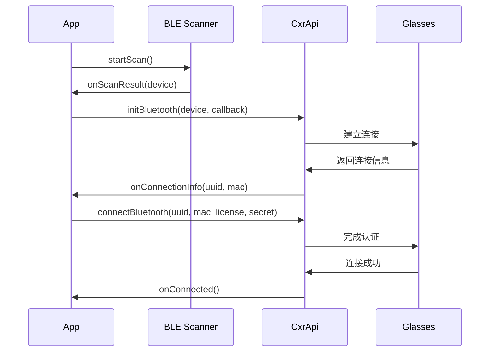
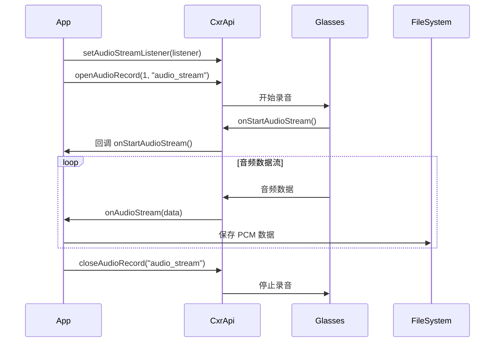
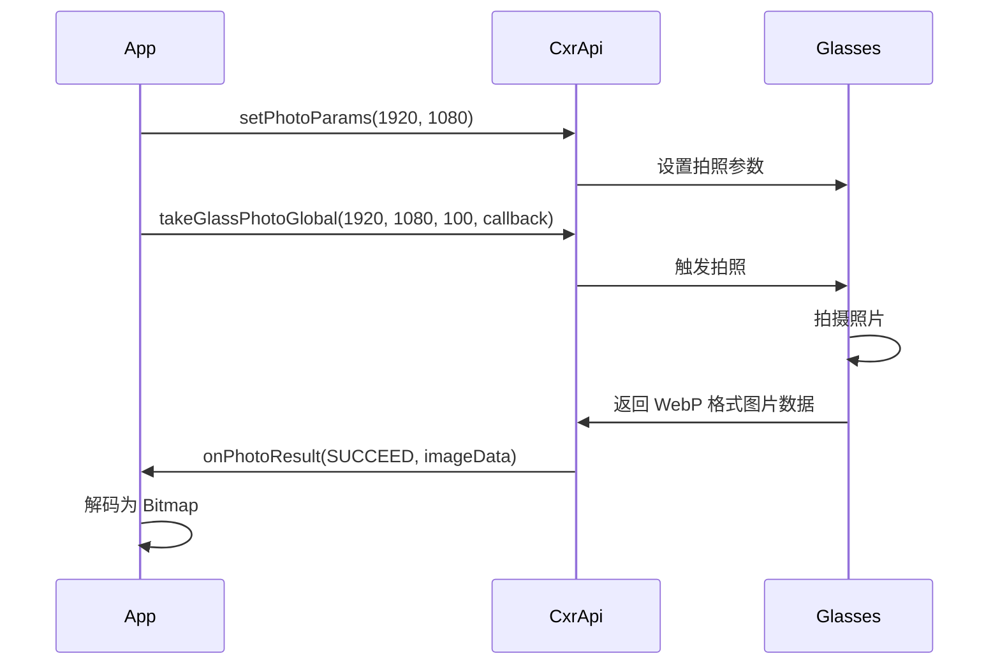
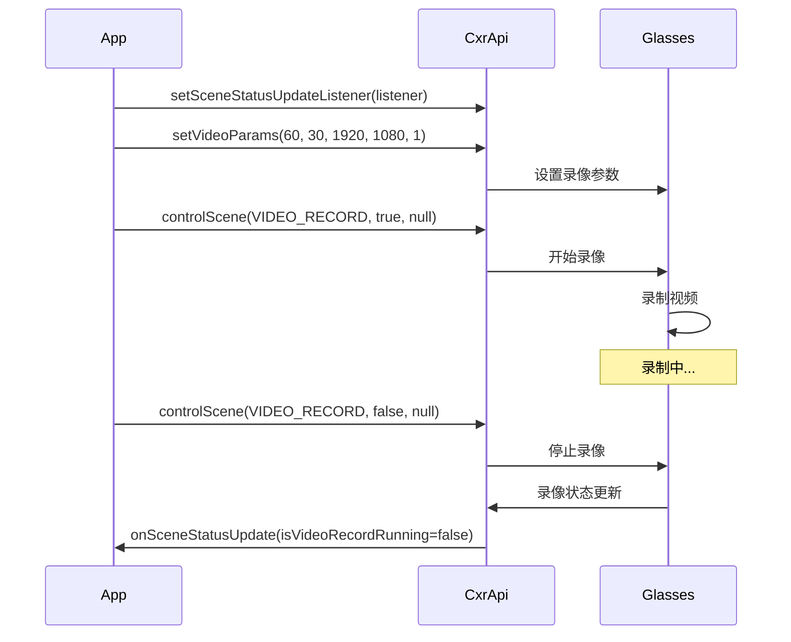
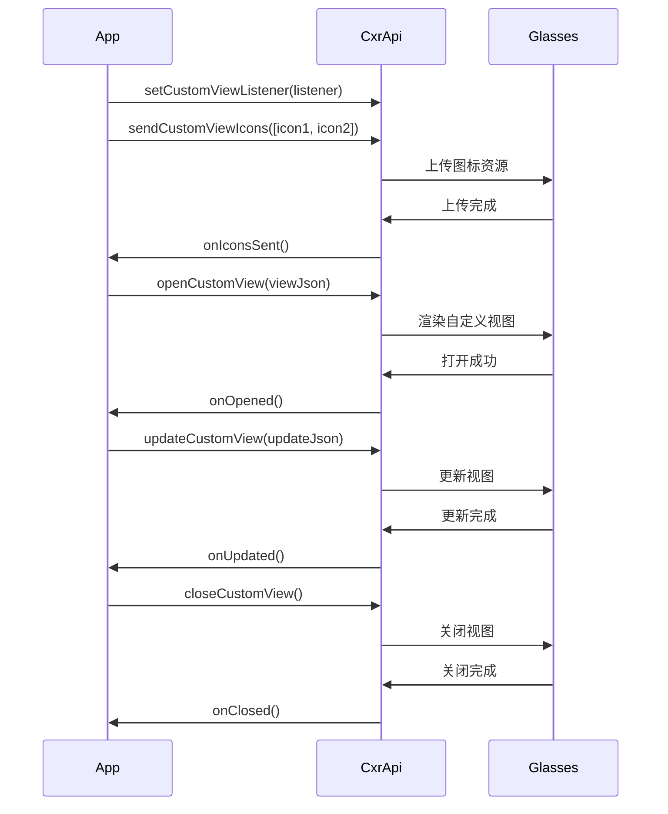
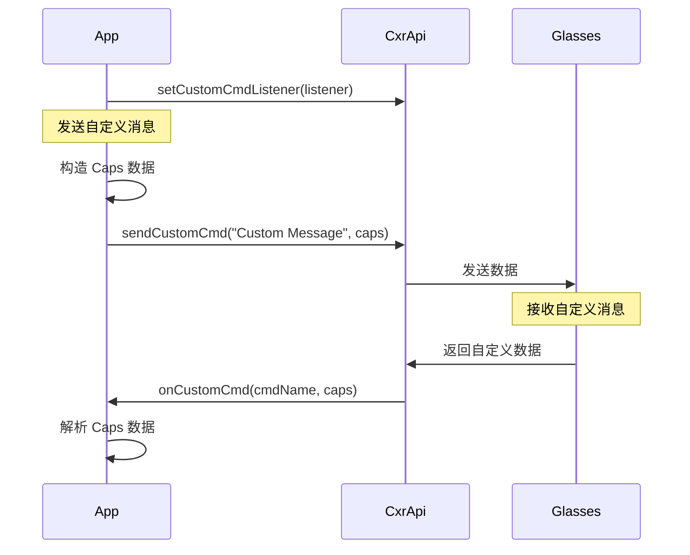
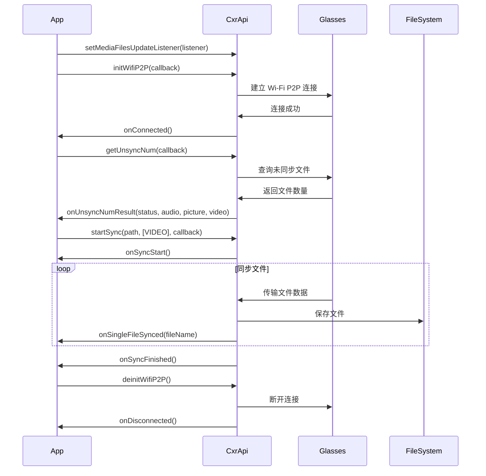

# 接口说明书设计文档

## 概述

本设计文档定义了 Rokid CXRM Samples Android 应用的完整接口说明书结构。该说明书将作为开发者使用 Rokid 智能眼镜 SDK 的权威参考文档，涵盖蓝牙连接、音频、视频、拍照、设备信息、自定义视图、自定义协议和媒体文件管理等所有功能模块的接口。

接口说明书将采用 Markdown 格式编写，包含详细的接口签名、参数说明、返回值、示例代码、数据模型和流程图，便于开发者快速理解和使用。

## 架构

### 文档结构

接口说明书采用模块化的文档结构，主要包含以下部分：

```
API-Documentation.md
├── 1. 文档信息
│   ├── 版本信息
│   ├── 更新日期
│   └── 目录
├── 2. 概述
│   ├── SDK 简介
│   ├── 核心功能
│   └── 系统要求
├── 3. 快速开始
│   ├── 环境配置
│   ├── 权限配置
│   └── 初始化流程
├── 4. 功能模块接口
│   ├── 4.1 蓝牙连接模块
│   ├── 4.2 音频功能模块
│   ├── 4.3 图片拍摄模块
│   ├── 4.4 视频录制模块
│   ├── 4.5 设备信息模块
│   ├── 4.6 自定义视图模块
│   ├── 4.7 自定义协议模块
│   └── 4.8 媒体文件管理模块
├── 5. 数据模型
│   ├── 枚举类型
│   ├── 数据类
│   └── 回调接口
├── 6. 错误处理
│   ├── 错误码定义
│   ├── 异常类型
│   └── 处理建议
└── 7. 附录
    ├── 常见问题
    ├── 版本兼容性
    └── 最佳实践
```

### 接口分类

根据功能将接口分为以下 8 个主要模块：

1. **蓝牙连接模块 (Bluetooth Connection)**: 负责设备扫描、配对、连接和断开
2. **音频功能模块 (Audio)**: 负责音频录制、播放和拾音声场切换
3. **图片拍摄模块 (Picture)**: 负责拍照参数设置和图片采集
4. **视频录制模块 (Video)**: 负责视频录制参数设置和录制控制
5. **设备信息模块 (Device Information)**: 负责设备信息查询和设备控制
6. **自定义视图模块 (Custom View)**: 负责在眼镜上显示自定义界面
7. **自定义协议模块 (Custom Protocol)**: 负责自定义数据通信
8. **媒体文件管理模块 (Media File)**: 负责媒体文件同步和传输

### 核心 SDK 类

所有接口调用都通过 `CxrApi` 单例类进行：

```kotlin
CxrApi.getInstance()
```


## 组件和接口

### 4.1 蓝牙连接模块

#### 接口列表

| 接口名称 | 方法签名 | 功能描述 |
|---------|---------|---------|
| initBluetooth | `initBluetooth(context: Context, device: BluetoothDevice?, callback: BluetoothStatusCallback)` | 初始化蓝牙连接 |
| connectBluetooth | `connectBluetooth(context: Context, uuid: String, macAddress: String, callback: BluetoothStatusCallback, licenseData: ByteArray, clientSecret: String)` | 连接已配对的蓝牙设备 |
| deinitBluetooth | `deinitBluetooth()` | 断开蓝牙连接 |
| isBluetoothConnected | `isBluetoothConnected: Boolean` | 获取蓝牙连接状态 |

#### 数据结构

**BluetoothStatusCallback 接口**:
```kotlin
interface BluetoothStatusCallback {
    fun onConnectionInfo(uuid: String?, macAddress: String?, p2: String?, p3: Int)
    fun onConnected()
    fun onDisconnected()
    fun onFailed(errorCode: ValueUtil.CxrBluetoothErrorCode?)
}
```

**DeviceItem 数据类**:
```kotlin
data class DeviceItem(
    val device: BluetoothDevice?,
    val name: String,
    val macAddress: String,
    val rssi: Int
)
```

#### 调用流程



#### 权限要求

- `android.permission.BLUETOOTH`
- `android.permission.BLUETOOTH_ADMIN`
- `android.permission.ACCESS_COARSE_LOCATION`
- `android.permission.ACCESS_FINE_LOCATION`
- `android.permission.BLUETOOTH_CONNECT` (Android 12+)
- `android.permission.BLUETOOTH_SCAN` (Android 12+)

#### 配置参数

- **SERVICE_UUID**: `"00009100-0000-1000-8000-00805f9b34fb"`
- **CLIENT_SECRET**: 从 Rokid 开发者平台获取
- **License File**: `.lc` 格式的授权文件


### 4.2 音频功能模块

#### 接口列表

| 接口名称 | 方法签名 | 功能描述 |
|---------|---------|---------|
| setAudioStreamListener | `setAudioStreamListener(listener: AudioStreamListener?)` | 设置音频流监听器 |
| openAudioRecord | `openAudioRecord(codeType: Int, streamType: String)` | 开始音频录制 |
| closeAudioRecord | `closeAudioRecord(streamType: String)` | 停止音频录制 |
| changeAudioSceneId | `changeAudioSceneId(sceneId: Int, callback: (Int, Boolean) -> Unit)` | 切换拾音声场 |

#### 数据结构

**AudioStreamListener 接口**:
```kotlin
interface AudioStreamListener {
    fun onStartAudioStream(codeType: Int, streamType: String?)
    fun onAudioStream(data: ByteArray?, offset: Int, size: Int)
}
```

**AudioSceneId 枚举**:
```kotlin
enum class AudioSceneId(val id: Int, val sceneName: String) {
    NEAR(0, "Near"),      // 近场拾音
    FAR(1, "Far"),        // 远场拾音
    BOTH(2, "Both")       // 全景拾音
}
```

**PlayState 枚举**:
```kotlin
enum class PlayState {
    PLAYING,   // 播放中
    PAUSED,    // 已暂停
    STOPPED    // 已停止
}
```

#### 音频参数

- **采样率**: 16000 Hz
- **声道**: 单声道 (MONO)
- **编码格式**: PCM 16-bit
- **文件格式**: `.pcm`
- **存储路径**: `/sdcard/Download/Rokid/audioRecord/`

#### 调用流程



#### 示例代码

```kotlin
// 设置音频流监听器
val audioListener = object : AudioStreamListener {
    override fun onStartAudioStream(codeType: Int, streamType: String?) {
        val fileName = "cxrM_${System.currentTimeMillis()}.pcm"
        // 创建文件准备录制
    }
    
    override fun onAudioStream(data: ByteArray?, offset: Int, size: Int) {
        // 将音频数据写入文件
        data?.let {
            fileOutputStream.write(it, offset, size)
        }
    }
}

// 开始录音
CxrApi.getInstance().setAudioStreamListener(audioListener)
CxrApi.getInstance().openAudioRecord(1, "audio_stream")

// 切换拾音声场
CxrApi.getInstance().changeAudioSceneId(AudioSceneId.FAR.id) { id, success ->
    if (success) {
        // 切换成功
    }
}

// 停止录音
CxrApi.getInstance().closeAudioRecord("audio_stream")
CxrApi.getInstance().setAudioStreamListener(null)
```


### 4.3 图片拍摄模块

#### 接口列表

| 接口名称 | 方法签名 | 功能描述 |
|---------|---------|---------|
| setPhotoParams | `setPhotoParams(width: Int, height: Int)` | 设置拍照参数 |
| takeGlassPhotoGlobal | `takeGlassPhotoGlobal(width: Int, height: Int, quality: Int, callback: PhotoResultCallback)` | 拍摄照片 |

#### 数据结构

**PhotoResultCallback 接口**:
```kotlin
fun interface PhotoResultCallback {
    fun onPhotoResult(status: ValueUtil.CxrStatus, imageData: ByteArray)
}
```

**支持的分辨率**:
```kotlin
val pictureSize: Array<Size> = arrayOf(
    Size(1920, 1080),   // Full HD
    Size(4032, 3024),   // 12MP
    Size(4000, 3000),   // 12MP
    Size(3264, 2448),   // 8MP
    Size(2560, 1440),   // 2K
    Size(1280, 720),    // HD
    // ... 更多分辨率选项
)
```

#### 调用流程



#### 示例代码

```kotlin
// 设置拍照参数
CxrApi.getInstance().setPhotoParams(1920, 1080)

// 拍照
val pictureCallback = PhotoResultCallback { status, imageData ->
    when(status) {
        ValueUtil.CxrStatus.RESPONSE_SUCCEED -> {
            // imageData 是 WebP 格式图片
            val bitmap = BitmapFactory.decodeByteArray(imageData, 0, imageData.size)
            // 显示或保存图片
        }
        else -> {
            // 拍照失败
        }
    }
}

CxrApi.getInstance().takeGlassPhotoGlobal(
    width = 1920,
    height = 1080,
    quality = 100,
    callback = pictureCallback
)
```

#### 注意事项

- 图片数据格式为 **WebP**
- 质量参数范围: 0-100
- 拍照过程是异步的，通过回调返回结果
- 建议在拍照前先调用 `setPhotoParams` 设置参数


### 4.4 视频录制模块

#### 接口列表

| 接口名称 | 方法签名 | 功能描述 |
|---------|---------|---------|
| setVideoParams | `setVideoParams(duration: Int, fps: Int, width: Int, height: Int, unit: Int)` | 设置视频录制参数 |
| controlScene | `controlScene(sceneType: ValueUtil.CxrSceneType, enable: Boolean, callback: ((Boolean) -> Unit)?)` | 控制场景（开始/停止录像）|
| setSceneStatusUpdateListener | `setSceneStatusUpdateListener(listener: SceneStatusUpdateListener?)` | 设置场景状态监听器 |

#### 数据结构

**SceneStatusUpdateListener 接口**:
```kotlin
fun interface SceneStatusUpdateListener {
    fun onSceneStatusUpdate(sceneStatus: SceneStatus?)
}
```

**SceneStatus 类**:
```kotlin
class SceneStatus {
    val isVideoRecordRunning: Boolean  // 视频录制是否正在运行
}
```

**DurationUnit 枚举**:
```kotlin
enum class DurationUnit {
    SECONDS,   // 秒
    MINUTES    // 分钟
}
```

**支持的分辨率**:
```kotlin
val videoSize: Array<Size> = arrayOf(
    Size(1920, 1080),   // Full HD
    Size(4032, 3024),   // 4K
    Size(3264, 2448),   // 2K+
    Size(1280, 720),    // HD
    // ... 更多分辨率选项
)
```

#### 调用流程



#### 示例代码

```kotlin
// 设置场景状态监听器
val sceneStatusUpdateListener = SceneStatusUpdateListener { sceneStatus ->
    sceneStatus?.isVideoRecordRunning?.let { isRecording ->
        if (!isRecording) {
            // 录像已停止
        }
    }
}
CxrApi.getInstance().setSceneStatusUpdateListener(sceneStatusUpdateListener)

// 设置视频参数
CxrApi.getInstance().setVideoParams(
    duration = 60,      // 时长: 60
    fps = 30,           // 帧率: 30fps
    width = 1920,       // 宽度: 1920
    height = 1080,      // 高度: 1080
    unit = 1            // 单位: 1=秒, 0=分钟
)

// 开始录像
CxrApi.getInstance().controlScene(
    ValueUtil.CxrSceneType.VIDEO_RECORD,
    true,
    null
)

// 停止录像
CxrApi.getInstance().controlScene(
    ValueUtil.CxrSceneType.VIDEO_RECORD,
    false,
    null
)

// 清理监听器
CxrApi.getInstance().setSceneStatusUpdateListener(null)
```

#### 参数说明

- **duration**: 录制时长，配合 unit 参数使用
- **fps**: 帧率，通常设置为 30
- **width/height**: 视频分辨率
- **unit**: 时长单位，0=分钟，1=秒


### 4.5 设备信息模块

#### 接口列表

| 接口名称 | 方法签名 | 功能描述 |
|---------|---------|---------|
| getGlassInfo | `getGlassInfo(callback: GlassInfoResultCallback)` | 获取设备所有信息 |
| setBatteryLevelUpdateListener | `setBatteryLevelUpdateListener(listener: BatteryLevelUpdateListener?)` | 设置电量监听器 |
| setBrightnessUpdateListener | `setBrightnessUpdateListener(listener: BrightnessUpdateListener?)` | 设置亮度监听器 |
| setVolumeUpdateListener | `setVolumeUpdateListener(listener: VolumeUpdateListener?)` | 设置音量监听器 |
| setScreenStatusUpdateListener | `setScreenStatusUpdateListener(listener: ScreenStatusUpdateListener?)` | 设置屏幕状态监听器 |
| setGlassBrightness | `setGlassBrightness(level: Int): ValueUtil.CxrStatus` | 设置眼镜亮度 |
| setGlassVolume | `setGlassVolume(level: Int): ValueUtil.CxrStatus` | 设置眼镜音量 |
| notifyGlassScreenOff | `notifyGlassScreenOff(): ValueUtil.CxrStatus` | 通知眼镜熄屏 |

#### 数据结构

**GlassInfoResultCallback 接口**:
```kotlin
fun interface GlassInfoResultCallback {
    fun onGlassInfoResult(status: ValueUtil.CxrStatus, glassInfo: GlassInfo?)
}
```

**GlassInfo 类**:
```kotlin
class GlassInfo {
    val deviceName: String          // 设备名称
    val deviceId: String            // 设备 SN
    val systemVersion: String       // 系统版本
    val wearingStatus: String       // 佩戴状态: "1"=佩戴, "0"=未佩戴
    val brightness: Int             // 亮度 (0-15)
    val volume: Int                 // 音量 (0-100)
    val batteryLevel: Int           // 电量 (0-100)
    val isCharging: Boolean         // 是否充电中
}
```

**监听器接口**:
```kotlin
fun interface BatteryLevelUpdateListener {
    fun onBatteryLevelUpdate(level: Int, isCharging: Boolean)
}

fun interface BrightnessUpdateListener {
    fun onBrightnessUpdate(level: Int)
}

fun interface VolumeUpdateListener {
    fun onVolumeUpdate(level: Int)
}

fun interface ScreenStatusUpdateListener {
    fun onScreenStatusUpdate(isScreenOn: Boolean)
}
```

**CxrStatus 枚举**:
```kotlin
enum class CxrStatus {
    REQUEST_SUCCEED,    // 请求成功
    REQUEST_FAILED,     // 请求失败
    REQUEST_WAITING,    // 请求排队中
    RESPONSE_SUCCEED,   // 响应成功
    RESPONSE_FAILED     // 响应失败
}
```

#### 示例代码

```kotlin
// 获取设备所有信息
val glassInfoCallback = GlassInfoResultCallback { status, glassInfo ->
    if (status == ValueUtil.CxrStatus.RESPONSE_SUCCEED) {
        glassInfo?.let { info ->
            println("设备名称: ${info.deviceName}")
            println("SN: ${info.deviceId}")
            println("系统版本: ${info.systemVersion}")
            println("佩戴状态: ${if (info.wearingStatus == "1") "佩戴中" else "未佩戴"}")
            println("亮度: ${info.brightness}")
            println("音量: ${info.volume}")
            println("电量: ${info.batteryLevel}%")
            println("充电状态: ${if (info.isCharging) "充电中" else "未充电"}")
        }
    }
}
CxrApi.getInstance().getGlassInfo(glassInfoCallback)

// 监听电量变化
val batteryListener = BatteryLevelUpdateListener { level, isCharging ->
    println("电量: $level%, 充电: $isCharging")
}
CxrApi.getInstance().setBatteryLevelUpdateListener(batteryListener)

// 监听亮度变化
val brightnessListener = BrightnessUpdateListener { level ->
    println("亮度: $level")
}
CxrApi.getInstance().setBrightnessUpdateListener(brightnessListener)

// 设置亮度 (0-15)
val status = CxrApi.getInstance().setGlassBrightness(10)
when(status) {
    ValueUtil.CxrStatus.REQUEST_SUCCEED -> println("设置成功")
    ValueUtil.CxrStatus.REQUEST_FAILED -> println("设置失败")
    ValueUtil.CxrStatus.REQUEST_WAITING -> println("命令排队中")
    else -> println("未知状态")
}

// 设置音量 (0-100)
CxrApi.getInstance().setGlassVolume(50)

// 通知眼镜熄屏
CxrApi.getInstance().notifyGlassScreenOff()

// 取消监听器
CxrApi.getInstance().setBatteryLevelUpdateListener(null)
CxrApi.getInstance().setBrightnessUpdateListener(null)
```

#### 参数范围

- **亮度 (Brightness)**: 0-15
- **音量 (Volume)**: 0-100
- **电量 (Battery)**: 0-100


### 4.6 自定义视图模块

#### 接口列表

| 接口名称 | 方法签名 | 功能描述 |
|---------|---------|---------|
| setCustomViewListener | `setCustomViewListener(listener: CustomViewListener?)` | 设置自定义视图监听器 |
| sendCustomViewIcons | `sendCustomViewIcons(icons: List<IconInfo>)` | 上传图标资源 |
| openCustomView | `openCustomView(viewJson: String)` | 打开自定义视图 |
| updateCustomView | `updateCustomView(updateJson: String)` | 更新自定义视图 |
| closeCustomView | `closeCustomView()` | 关闭自定义视图 |

#### 数据结构

**CustomViewListener 接口**:
```kotlin
interface CustomViewListener {
    fun onIconsSent()                    // 图标上传完成
    fun onOpened()                       // 视图已打开
    fun onOpenFailed(errorCode: Int)     // 打开失败
    fun onUpdated()                      // 视图已更新
    fun onClosed()                       // 视图已关闭
}
```

**IconInfo 类**:
```kotlin
class IconInfo(
    val name: String,        // 图标名称
    val base64Data: String   // Base64 编码的图片数据
)
```

**视图 JSON 结构**:
```kotlin
// SelfViewJson - 视图定义
class SelfViewJson {
    var type: String                    // 组件类型: "LinearLayout", "TextView", "ImageView"
    var props: String                   // 属性 JSON 字符串
    var children: List<SelfViewJson>?   // 子组件列表
}

// UpdateViewJson - 视图更新
class UpdateViewJson {
    val updateList: MutableList<UpdateJson>
    
    class UpdateJson(val id: String) {
        val props: MutableMap<String, Any>  // 要更新的属性
    }
}
```

**支持的组件类型**:
- **LinearLayout**: 线性布局容器
- **RelativeLayout**: 相对布局容器
- **TextView**: 文本组件
- **ImageView**: 图片组件

#### 调用流程



#### 示例代码

```kotlin
// 1. 设置监听器
val customViewListener = object : CustomViewListener {
    override fun onIconsSent() {
        println("图标上传完成")
    }
    
    override fun onOpened() {
        println("自定义视图已打开")
    }
    
    override fun onOpenFailed(errorCode: Int) {
        println("打开失败: $errorCode")
    }
    
    override fun onUpdated() {
        println("视图已更新")
    }
    
    override fun onClosed() {
        println("视图已关闭")
    }
}
CxrApi.getInstance().setCustomViewListener(customViewListener)

// 2. 上传图标资源
val icon1Bitmap = BitmapFactory.decodeResource(resources, R.drawable.icon1)
val outputStream = ByteArrayOutputStream()
icon1Bitmap.compress(Bitmap.CompressFormat.PNG, 100, outputStream)
val icon1Base64 = Base64.encodeToString(outputStream.toByteArray(), Base64.NO_WRAP)

val iconInfo = IconInfo("icon1", icon1Base64)
CxrApi.getInstance().sendCustomViewIcons(listOf(iconInfo))

// 3. 创建视图 JSON
val viewJson = SelfViewJson().apply {
    type = "LinearLayout"
    props = LinearLayoutProps().apply {
        id = "root"
        layout_width = "match_parent"
        layout_height = "match_parent"
        backgroundColor = "#FF000000"
        orientation = "vertical"
    }.toJson()
    children = listOf(
        SelfViewJson().apply {
            type = "TextView"
            props = TextViewProps().apply {
                id = "textView"
                text = "Hello World"
                textColor = "#00FF00"
                textSize = "16sp"
            }.toJson()
        },
        SelfViewJson().apply {
            type = "ImageView"
            props = ImageViewProps().apply {
                id = "imageView"
                name = "icon1"
                layout_width = "120dp"
                layout_height = "120dp"
            }.toJson()
        }
    )
}.toJson()

// 4. 打开自定义视图
CxrApi.getInstance().openCustomView(viewJson)

// 5. 更新视图
val updateJson = UpdateViewJson().apply {
    updateList.add(UpdateJson("textView").apply {
        props["text"] = "Hello Rokid"
    })
}.toJson()
CxrApi.getInstance().updateCustomView(updateJson)

// 6. 关闭视图
CxrApi.getInstance().closeCustomView()
```

#### 布局属性

**LinearLayoutProps**:
- `id`: 组件 ID
- `layout_width`, `layout_height`: 尺寸 ("match_parent", "wrap_content", "120dp")
- `backgroundColor`: 背景颜色 ("#RRGGBB")
- `orientation`: 方向 ("vertical", "horizontal")
- `gravity`: 对齐方式
- `marginTop`, `marginBottom`, `paddingStart`, `paddingEnd`: 间距

**TextViewProps**:
- `id`: 组件 ID
- `text`: 文本内容
- `textColor`: 文本颜色
- `textSize`: 文本大小 ("16sp")
- `textStyle`: 文本样式 ("bold", "italic")
- `gravity`: 对齐方式

**ImageViewProps**:
- `id`: 组件 ID
- `name`: 图标名称（对应上传的图标）
- `scaleType`: 缩放类型 ("center", "fitXY")


### 4.7 自定义协议模块

#### 接口列表

| 接口名称 | 方法签名 | 功能描述 |
|---------|---------|---------|
| setCustomCmdListener | `setCustomCmdListener(listener: CustomCmdListener?)` | 设置自定义命令监听器 |
| sendCustomCmd | `sendCustomCmd(cmdName: String, caps: Caps)` | 发送自定义命令 |

#### 数据结构

**CustomCmdListener 接口**:
```kotlin
fun interface CustomCmdListener {
    fun onCustomCmd(cmdName: String?, caps: Caps?)
}
```

**Caps 类** (数据容器):
```kotlin
class Caps {
    // 写入数据
    fun write(value: String)
    fun writeInt32(value: Int)
    fun write(value: Boolean)
    fun write(value: Caps)  // 嵌套 Caps
    
    // 读取数据
    fun size(): Int
    fun at(index: Int): Value
    
    // Value 类型
    class Value {
        fun type(): Int
        val string: String
        val int: Int
        val float: Float
        val double: Double
        val binary: Binary
        val `object`: Caps
        
        companion object {
            const val TYPE_STRING = 0
            const val TYPE_INT32 = 1
            const val TYPE_FLOAT = 2
            const val TYPE_BINARY = 3
            const val TYPE_DOUBLE = 4
            const val TYPE_UINT32 = 5
            const val TYPE_OBJECT = 6
        }
    }
}
```

#### 调用流程



#### 示例代码

```kotlin
// 1. 设置自定义命令监听器
val customCmdListener = CustomCmdListener { cmdName, caps ->
    if (cmdName == "Custom CMD") {
        caps?.let {
            val message = parseCaps(it)
            println("收到消息: $message")
        }
    }
}
CxrApi.getInstance().setCustomCmdListener(customCmdListener)

// 2. 发送自定义消息
val caps = Caps().apply {
    write("Custom String Message:")
    writeInt32(123)
    write(true)
    
    // 嵌套 Caps
    write(Caps().apply {
        write("Nested String Message")
    })
}
CxrApi.getInstance().sendCustomCmd("Custom Message", caps)

// 3. 解析 Caps 数据
fun parseCaps(caps: Caps): String {
    val sb = StringBuilder()
    for (i in 0 until caps.size()) {
        val value = caps.at(i)
        when (value.type()) {
            Caps.Value.TYPE_STRING -> {
                sb.append("String: ${value.string}, ")
            }
            Caps.Value.TYPE_INT32 -> {
                sb.append("Int: ${value.int}, ")
            }
            Caps.Value.TYPE_FLOAT -> {
                sb.append("Float: ${value.float}, ")
            }
            Caps.Value.TYPE_BINARY -> {
                val base64 = Base64.encodeToString(value.binary.data, Base64.DEFAULT)
                sb.append("Binary: $base64, ")
            }
            Caps.Value.TYPE_DOUBLE -> {
                sb.append("Double: ${value.double}, ")
            }
            Caps.Value.TYPE_OBJECT -> {
                sb.append("Object: ${parseCaps(value.`object`)}, ")
            }
        }
    }
    return sb.toString()
}

// 4. 清理监听器
CxrApi.getInstance().setCustomCmdListener(null)
```

#### 数据类型支持

Caps 支持以下数据类型：
- **String**: 字符串
- **Int32**: 32位整数
- **Float**: 浮点数
- **Double**: 双精度浮点数
- **Binary**: 二进制数据
- **Boolean**: 布尔值
- **Object**: 嵌套的 Caps 对象

#### 使用场景

自定义协议可用于：
- 应用与眼镜之间的自定义数据交换
- 实现特定业务逻辑的通信
- 传输结构化数据
- 支持嵌套数据结构


### 4.8 媒体文件管理模块

#### 接口列表

| 接口名称 | 方法签名 | 功能描述 |
|---------|---------|---------|
| initWifiP2P | `initWifiP2P(callback: WifiP2PStatusCallback)` | 初始化 Wi-Fi P2P 连接 |
| deinitWifiP2P | `deinitWifiP2P()` | 断开 Wi-Fi P2P 连接 |
| getUnsyncNum | `getUnsyncNum(callback: UnsyncNumResultCallback)` | 获取未同步文件数量 |
| startSync | `startSync(savePath: String, mediaTypes: Array<ValueUtil.CxrMediaType>, callback: SyncStatusCallback)` | 开始同步媒体文件 |
| stopSync | `stopSync()` | 停止同步 |
| setMediaFilesUpdateListener | `setMediaFilesUpdateListener(listener: MediaFilesUpdateListener?)` | 设置媒体文件更新监听器 |

#### 数据结构

**WifiP2PStatusCallback 接口**:
```kotlin
interface WifiP2PStatusCallback {
    fun onConnected()
    fun onDisconnected()
    fun onFailed(errorCode: ValueUtil.CxrWifiErrorCode?)
}
```

**UnsyncNumResultCallback 接口**:
```kotlin
fun interface UnsyncNumResultCallback {
    fun onUnsyncNumResult(
        status: ValueUtil.CxrStatus,
        audioNum: Int,
        pictureNum: Int,
        videoNum: Int
    )
}
```

**SyncStatusCallback 接口**:
```kotlin
interface SyncStatusCallback {
    fun onSyncStart()
    fun onSingleFileSynced(fileName: String?)
    fun onSyncFailed()
    fun onSyncFinished()
}
```

**MediaFilesUpdateListener 接口**:
```kotlin
fun interface MediaFilesUpdateListener {
    fun onMediaFilesUpdate()
}
```

**CxrMediaType 枚举**:
```kotlin
enum class CxrMediaType {
    AUDIO,      // 音频文件
    PICTURE,    // 图片文件
    VIDEO       // 视频文件
}
```

**ConnectionStatus 枚举**:
```kotlin
enum class ConnectionStatus {
    CONNECTED,      // 已连接
    CONNECTING,     // 连接中
    DISCONNECTED    // 已断开
}
```

#### 调用流程



#### 示例代码

```kotlin
// 1. 设置媒体文件更新监听器
val mediaFilesUpdateListener = MediaFilesUpdateListener {
    // 眼镜中有新的媒体文件生成
    getUnsyncNum()
}
CxrApi.getInstance().setMediaFilesUpdateListener(mediaFilesUpdateListener)

// 2. 连接 Wi-Fi P2P
val wifiP2PCallback = object : WifiP2PStatusCallback {
    override fun onConnected() {
        println("Wi-Fi P2P 已连接")
    }
    
    override fun onDisconnected() {
        println("Wi-Fi P2P 已断开")
    }
    
    override fun onFailed(errorCode: ValueUtil.CxrWifiErrorCode?) {
        println("连接失败: $errorCode")
    }
}
CxrApi.getInstance().initWifiP2P(wifiP2PCallback)

// 3. 获取未同步文件数量
val unsyncNumCallback = UnsyncNumResultCallback { status, audioNum, pictureNum, videoNum ->
    if (status == ValueUtil.CxrStatus.RESPONSE_SUCCEED) {
        println("音频: $audioNum, 图片: $pictureNum, 视频: $videoNum")
    }
}
CxrApi.getInstance().getUnsyncNum(unsyncNumCallback)

// 4. 开始同步媒体文件
val syncCallback = object : SyncStatusCallback {
    override fun onSyncStart() {
        println("开始同步")
    }
    
    override fun onSingleFileSynced(fileName: String?) {
        println("文件已同步: $fileName")
    }
    
    override fun onSyncFailed() {
        println("同步失败")
    }
    
    override fun onSyncFinished() {
        println("同步完成")
    }
}

val savePath = "/sdcard/Download/Rokid/Media/"
val mediaTypes = arrayOf(
    ValueUtil.CxrMediaType.VIDEO,
    ValueUtil.CxrMediaType.PICTURE,
    ValueUtil.CxrMediaType.AUDIO
)
CxrApi.getInstance().startSync(savePath, mediaTypes, syncCallback)

// 5. 停止同步
CxrApi.getInstance().stopSync()

// 6. 断开 Wi-Fi P2P
CxrApi.getInstance().deinitWifiP2P()
```

#### 权限要求

- `android.permission.NEARBY_WIFI_DEVICES` (Android 13+)
- Wi-Fi 需要开启

#### 注意事项

- 同步前需要先建立 Wi-Fi P2P 连接
- 同步路径需要有写入权限
- 可以选择性同步特定类型的媒体文件
- 同步过程中可以随时停止


## 数据模型

### 枚举类型汇总

#### ValueUtil.CxrStatus
```kotlin
enum class CxrStatus {
    REQUEST_SUCCEED,    // 请求成功
    REQUEST_FAILED,     // 请求失败
    REQUEST_WAITING,    // 请求排队中
    RESPONSE_SUCCEED,   // 响应成功
    RESPONSE_FAILED     // 响应失败
}
```

#### ValueUtil.CxrSceneType
```kotlin
enum class CxrSceneType {
    VIDEO_RECORD,       // 视频录制场景
    // 其他场景类型...
}
```

#### ValueUtil.CxrMediaType
```kotlin
enum class CxrMediaType {
    AUDIO,      // 音频文件
    PICTURE,    // 图片文件
    VIDEO       // 视频文件
}
```

#### ValueUtil.CxrBluetoothErrorCode
```kotlin
enum class CxrBluetoothErrorCode {
    // 蓝牙错误码定义
}
```

#### ValueUtil.CxrWifiErrorCode
```kotlin
enum class CxrWifiErrorCode {
    // Wi-Fi 错误码定义
}
```

#### UsageType (应用层枚举)
```kotlin
enum class UsageType {
    USAGE_TYPE_AUDIO,               // 音频功能
    USAGE_TYPE_VIDEO,               // 视频功能
    USAGE_TYPE_PHOTO,               // 拍照功能
    USAGE_TYPE_FILE,                // 文件管理
    USAGE_TYPE_AI,                  // AI 场景
    USAGE_CUSTOM_VIEW,              // 自定义视图
    USAGE_TYPE_CUSTOM_PROTOCOL,     // 自定义协议
    USAGE_TYPE_TELEPROMPTER,        // 提词器场景
    USAGE_TYPE_TRANSLATION,         // 翻译场景
    USAGE_TYPE_DEVICE_INFORMATION   // 设备信息
}
```

### 回调接口汇总

所有回调接口都遵循以下命名规范：
- **Listener**: 持续监听的回调（如状态变化）
- **Callback**: 一次性操作的回调（如请求响应）

#### 蓝牙相关
- `BluetoothStatusCallback`: 蓝牙连接状态回调

#### 音频相关
- `AudioStreamListener`: 音频流监听器

#### 图片相关
- `PhotoResultCallback`: 拍照结果回调

#### 视频相关
- `SceneStatusUpdateListener`: 场景状态更新监听器

#### 设备信息相关
- `GlassInfoResultCallback`: 设备信息查询回调
- `BatteryLevelUpdateListener`: 电量更新监听器
- `BrightnessUpdateListener`: 亮度更新监听器
- `VolumeUpdateListener`: 音量更新监听器
- `ScreenStatusUpdateListener`: 屏幕状态更新监听器

#### 自定义视图相关
- `CustomViewListener`: 自定义视图监听器

#### 自定义协议相关
- `CustomCmdListener`: 自定义命令监听器

#### 媒体文件相关
- `WifiP2PStatusCallback`: Wi-Fi P2P 状态回调
- `UnsyncNumResultCallback`: 未同步文件数量查询回调
- `SyncStatusCallback`: 同步状态回调
- `MediaFilesUpdateListener`: 媒体文件更新监听器

### 常量定义

#### CONSTANT 对象
```kotlin
object CONSTANT {
    // 蓝牙权限列表
    val BLUETOOTH_PERMISSIONS: Array<String>
    
    // 蓝牙服务 UUID
    const val SERVICE_UUID = "00009100-0000-1000-8000-00805f9b34fb"
    
    // 客户端密钥（从 Rokid 开发者平台获取）
    const val CLIENT_SECRET = "e5058adf-97a2-11f0-961e-043f72fdb9c8"
    
    // 自定义命令标识
    const val CUSTOM_CMD = "Custom CMD"
}
```

## 错误处理

### 错误码体系

#### CxrStatus 状态码
- `REQUEST_SUCCEED`: 请求已成功发送
- `REQUEST_FAILED`: 请求发送失败
- `REQUEST_WAITING`: 请求在队列中等待
- `RESPONSE_SUCCEED`: 收到成功响应
- `RESPONSE_FAILED`: 收到失败响应

### 异常处理策略

#### 1. 蓝牙连接异常
```kotlin
// 连接失败处理
override fun onFailed(errorCode: ValueUtil.CxrBluetoothErrorCode?) {
    when(errorCode) {
        // 根据错误码进行相应处理
        else -> {
            // 通用错误处理
            // 建议：重试连接或提示用户
        }
    }
}
```

#### 2. 接口调用异常
```kotlin
// 检查返回状态
val status = CxrApi.getInstance().setGlassBrightness(10)
when(status) {
    ValueUtil.CxrStatus.REQUEST_SUCCEED -> {
        // 请求成功，等待响应
    }
    ValueUtil.CxrStatus.REQUEST_FAILED -> {
        // 请求失败，检查连接状态
    }
    ValueUtil.CxrStatus.REQUEST_WAITING -> {
        // 命令排队中，稍后重试
    }
}
```

#### 3. 回调超时处理
```kotlin
// 建议为异步操作设置超时机制
val timeoutHandler = Handler(Looper.getMainLooper())
val timeoutRunnable = Runnable {
    // 超时处理逻辑
    Log.e(TAG, "操作超时")
}

// 设置 5 秒超时
timeoutHandler.postDelayed(timeoutRunnable, 5000)

// 操作成功后取消超时
timeoutHandler.removeCallbacks(timeoutRunnable)
```

### 最佳实践

#### 1. 连接状态检查
```kotlin
// 在调用接口前检查连接状态
if (CxrApi.getInstance().isBluetoothConnected) {
    // 执行操作
} else {
    // 提示用户连接设备
}
```

#### 2. 资源清理
```kotlin
// Activity/Fragment 销毁时清理监听器
override fun onDestroy() {
    super.onDestroy()
    CxrApi.getInstance().setAudioStreamListener(null)
    CxrApi.getInstance().setCustomViewListener(null)
    CxrApi.getInstance().setCustomCmdListener(null)
    // ... 清理其他监听器
}
```

#### 3. 权限检查
```kotlin
// 在使用功能前检查权限
fun checkPermissions(): Boolean {
    return CONSTANT.BLUETOOTH_PERMISSIONS.all {
        ActivityCompat.checkSelfPermission(context, it) == 
            PackageManager.PERMISSION_GRANTED
    }
}
```

#### 4. 线程安全
```kotlin
// UI 更新需要在主线程执行
CoroutineScope(Dispatchers.Main).launch {
    // 更新 UI
}

// 文件操作在 IO 线程执行
CoroutineScope(Dispatchers.IO).launch {
    // 文件读写操作
}
```

