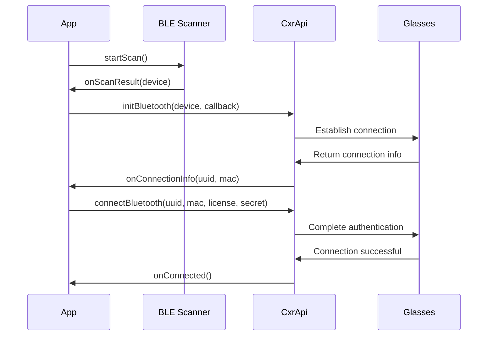
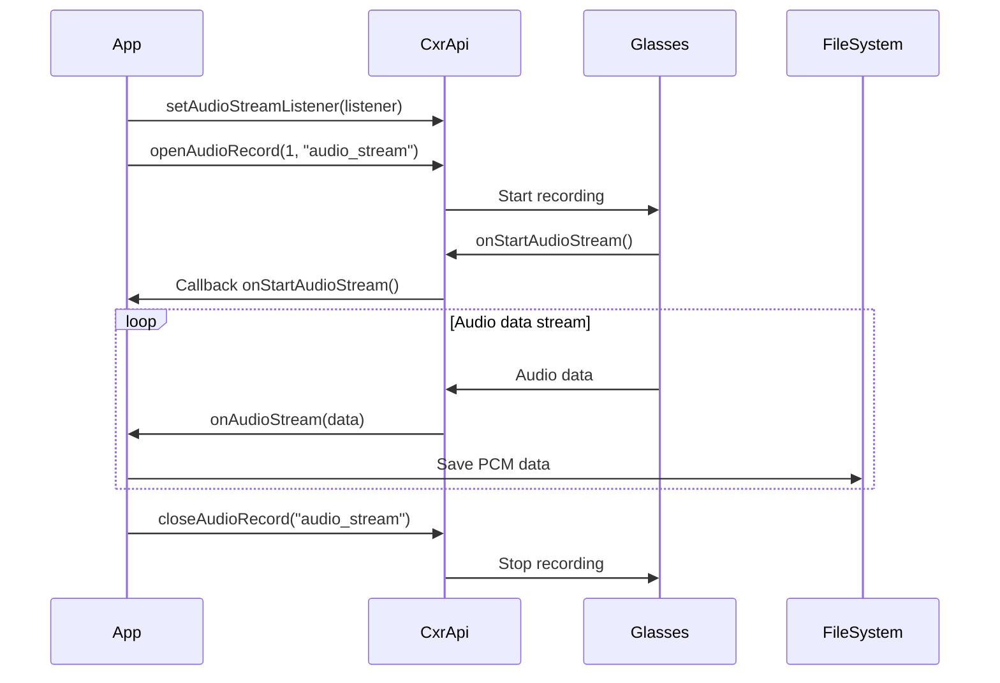
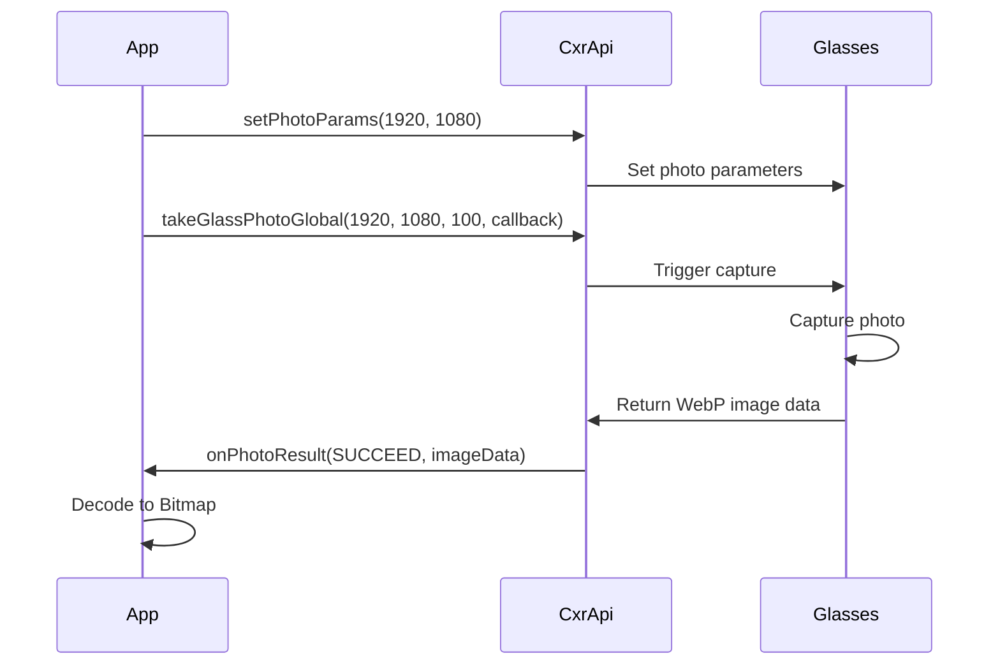
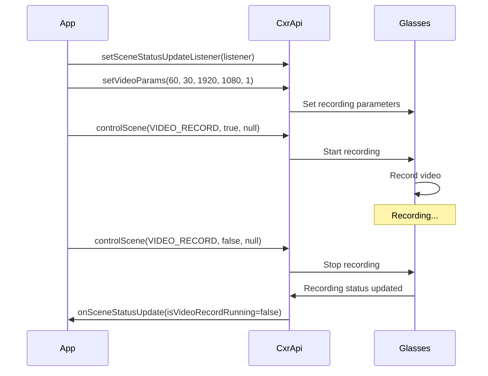
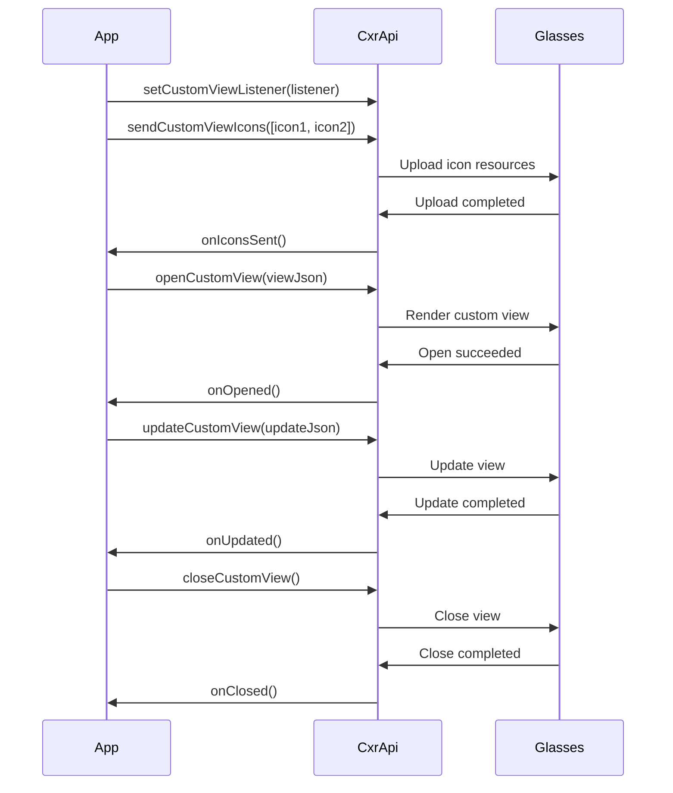
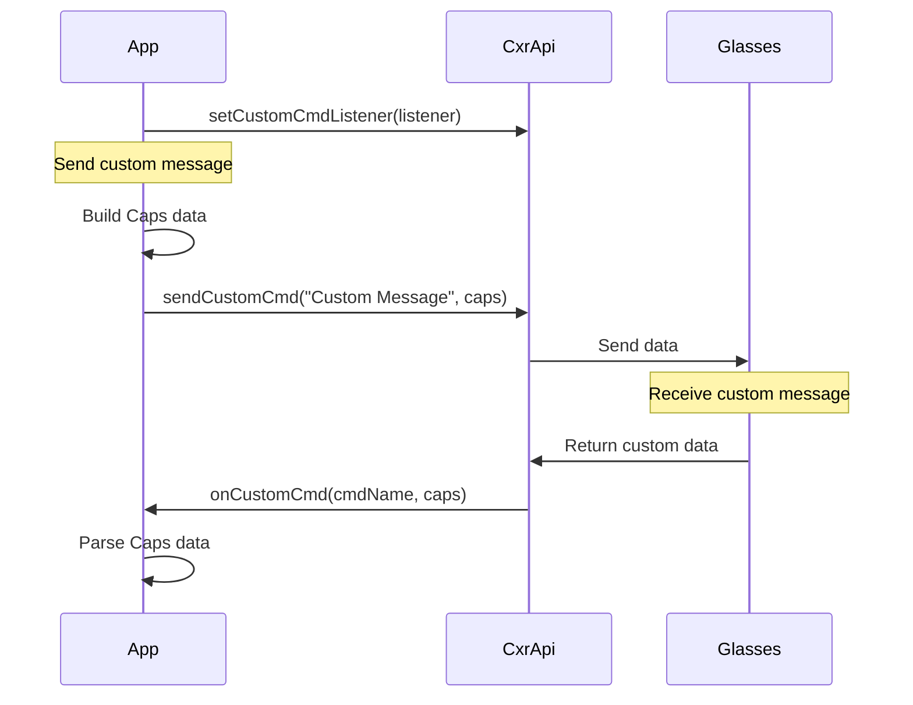
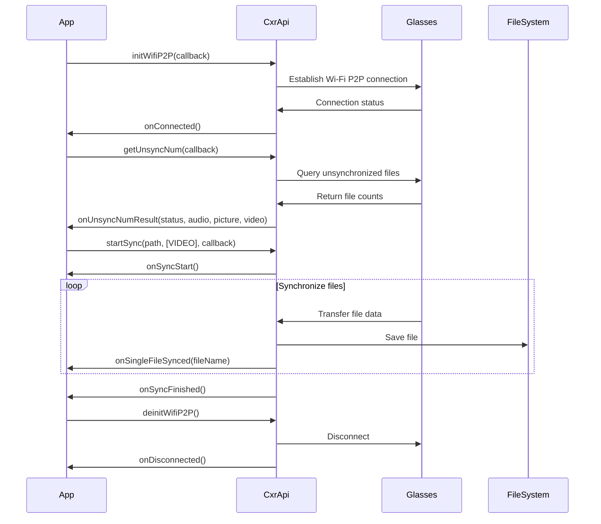

# Interface Documentation Design Document

## Overview

This design document defines the complete interface documentation structure for the Rokid CXRM Samples Android application. The documentation will serve as the authoritative reference for developers using the Rokid Smart Glasses SDK, covering all functional modules such as Bluetooth connection, audio, video, photo capture, device information, custom views, custom protocols, and media file management.

The interface documentation will be written in Markdown format and include detailed interface signatures, parameter descriptions, return values, sample code, data models, and flowcharts to help developers quickly understand and use the SDK.

## Architecture

### Documentation Structure

The interface documentation uses a modular structure and mainly contains the following sections:

```
API-Documentation.md
├── 1. Document Information
│   ├── Version Information
│   ├── Update Date
│   └── Table of Contents
├── 2. Overview
│   ├── SDK Introduction
│   ├── Core Features
│   └── System Requirements
├── 3. Quick Start
│   ├── Environment Setup
│   ├── Permission Configuration
│   └── Initialization Flow
├── 4. Functional Module Interfaces
│   ├── 4.1 Bluetooth Connection Module
│   ├── 4.2 Audio Module
│   ├── 4.3 Picture Capture Module
│   ├── 4.4 Video Recording Module
│   ├── 4.5 Device Information Module
│   ├── 4.6 Custom View Module
│   ├── 4.7 Custom Protocol Module
│   └── 4.8 Media File Management Module
├── 5. Data Models
│   ├── Enum Types
│   ├── Data Classes
│   └── Callback Interfaces
├── 6. Error Handling
│   ├── Error Code Definitions
│   ├── Exception Types
│   └── Handling Suggestions
└── 7. Appendix
    ├── FAQ
    ├── Version Compatibility
    └── Best Practices
```

### Interface Classification

Interfaces are divided into the following 8 major modules by function:

1. **Bluetooth Connection Module**: Responsible for device scanning, pairing, connection, and disconnection  
2. **Audio Module**: Responsible for audio recording, playback, and pickup scene switching  
3. **Picture Capture Module**: Responsible for photo parameter settings and image capture  
4. **Video Recording Module**: Responsible for video recording parameter settings and recording control  
5. **Device Information Module**: Responsible for device information queries and device control  
6. **Custom View Module**: Responsible for displaying custom UI on the glasses  
7. **Custom Protocol Module**: Responsible for custom data communication  
8. **Media File Management Module**: Responsible for media file synchronization and transfer  

### Core SDK Class

All interface calls are made through the `CxrApi` singleton class:

```kotlin
CxrApi.getInstance()
```


## Components and Interfaces

### 4.1 Bluetooth Connection Module

#### Interface List

| Interface Name     | Method Signature | Description                      |
|--------------------|-----------------|----------------------------------|
| initBluetooth      | `initBluetooth(context: Context, device: BluetoothDevice?, callback: BluetoothStatusCallback)` | Initialize Bluetooth connection |
| connectBluetooth   | `connectBluetooth(context: Context, uuid: String, macAddress: String, callback: BluetoothStatusCallback, licenseData: ByteArray, clientSecret: String)` | Connect to a paired Bluetooth device |
| deinitBluetooth    | `deinitBluetooth()` | Disconnect Bluetooth connection  |
| isBluetoothConnected | `isBluetoothConnected: Boolean` | Get Bluetooth connection status |

#### Data Structures

**BluetoothStatusCallback interface**:
```kotlin
interface BluetoothStatusCallback {
    fun onConnectionInfo(uuid: String?, macAddress: String?, p2: String?, p3: Int)
    fun onConnected()
    fun onDisconnected()
    fun onFailed(errorCode: ValueUtil.CxrBluetoothErrorCode?)
}
```

**DeviceItem data class**:
```kotlin
data class DeviceItem(
    val device: BluetoothDevice?,
    val name: String,
    val macAddress: String,
    val rssi: Int
)
```

#### Call Flow



#### Required Permissions

- `android.permission.BLUETOOTH`
- `android.permission.BLUETOOTH_ADMIN`
- `android.permission.ACCESS_COARSE_LOCATION`
- `android.permission.ACCESS_FINE_LOCATION`
- `android.permission.BLUETOOTH_CONNECT` (Android 12+)
- `android.permission.BLUETOOTH_SCAN` (Android 12+)

#### Configuration Parameters

- **SERVICE_UUID**: `"00009100-0000-1000-8000-00805f9b34fb"`
- **CLIENT_SECRET**: Obtained from the Rokid Developer Platform
- **License File**: Authorization file in `.lc` format


### 4.2 Audio Module

#### Interface List

| Interface Name          | Method Signature | Description                     |
|-------------------------|-----------------|---------------------------------|
| setAudioStreamListener  | `setAudioStreamListener(listener: AudioStreamListener?)` | Set the audio stream listener |
| openAudioRecord         | `openAudioRecord(codeType: Int, streamType: String)` | Start audio recording         |
| closeAudioRecord        | `closeAudioRecord(streamType: String)` | Stop audio recording          |
| changeAudioSceneId      | `changeAudioSceneId(sceneId: Int, callback: (Int, Boolean) -> Unit)` | Switch pickup scene          |

#### Data Structures

**AudioStreamListener interface**:
```kotlin
interface AudioStreamListener {
    fun onStartAudioStream(codeType: Int, streamType: String?)
    fun onAudioStream(data: ByteArray?, offset: Int, size: Int)
}
```

**AudioSceneId enum**:
```kotlin
enum class AudioSceneId(val id: Int, val sceneName: String) {
    NEAR(0, "Near"),      // Near-field pickup
    FAR(1, "Far"),        // Far-field pickup
    BOTH(2, "Both")       // Panorama pickup
}
```

**PlayState enum**:
```kotlin
enum class PlayState {
    PLAYING,   // Playing
    PAUSED,    // Paused
    STOPPED    // Stopped
}
```

#### Audio Parameters

- **Sample rate**: 16000 Hz  
- **Channel**: Mono (MONO)  
- **Encoding format**: PCM 16-bit  
- **File format**: `.pcm`  
- **Storage path**: `/sdcard/Download/Rokid/audioRecord/`  

#### Call Flow



#### Sample Code

```kotlin
// Set audio stream listener
val audioListener = object : AudioStreamListener {
    override fun onStartAudioStream(codeType: Int, streamType: String?) {
        val fileName = "cxrM_${System.currentTimeMillis()}.pcm"
        // Create file and prepare to record
    }
    
    override fun onAudioStream(data: ByteArray?, offset: Int, size: Int) {
        // Write audio data to file
        data?.let {
            fileOutputStream.write(it, offset, size)
        }
    }
}

// Start recording
CxrApi.getInstance().setAudioStreamListener(audioListener)
CxrApi.getInstance().openAudioRecord(1, "audio_stream")

// Switch pickup scene
CxrApi.getInstance().changeAudioSceneId(AudioSceneId.FAR.id) { id, success ->
    if (success) {
        // Switch succeeded
    }
}

// Stop recording
CxrApi.getInstance().closeAudioRecord("audio_stream")
CxrApi.getInstance().setAudioStreamListener(null)
```


### 4.3 Picture Capture Module

#### Interface List

| Interface Name   | Method Signature | Description              |
|------------------|-----------------|--------------------------|
| setPhotoParams   | `setPhotoParams(width: Int, height: Int)` | Set photo parameters |
| takeGlassPhotoGlobal | `takeGlassPhotoGlobal(width: Int, height: Int, quality: Int, callback: PhotoResultCallback)` | Take a photo |

#### Data Structures

**PhotoResultCallback interface**:
```kotlin
fun interface PhotoResultCallback {
    fun onPhotoResult(status: ValueUtil.CxrStatus, imageData: ByteArray)
}
```

**Supported resolutions**:
```kotlin
val pictureSize: Array<Size> = arrayOf(
    Size(1920, 1080),   // Full HD
    Size(4032, 3024),   // 12MP
    Size(4000, 3000),   // 12MP
    Size(3264, 2448),   // 8MP
    Size(2560, 1440),   // 2K
    Size(1280, 720),    // HD
    // ... more resolution options
)
```

#### Call Flow



#### Sample Code

```kotlin
// Set photo parameters
CxrApi.getInstance().setPhotoParams(1920, 1080)

// Take photo
val pictureCallback = PhotoResultCallback { status, imageData ->
    when(status) {
        ValueUtil.CxrStatus.RESPONSE_SUCCEED -> {
            // imageData is WebP format
            val bitmap = BitmapFactory.decodeByteArray(imageData, 0, imageData.size)
            // Display or save the image
        }
        else -> {
            // Capture failed
        }
    }
}

CxrApi.getInstance().takeGlassPhotoGlobal(
    width = 1920,
    height = 1080,
    quality = 100,
    callback = pictureCallback
)
```

#### Notes

- Image data format is **WebP**  
- Quality range: 0–100  
- Photo capture is asynchronous; results are returned via callback  
- It is recommended to call `setPhotoParams` before capturing to configure parameters  


### 4.4 Video Recording Module

#### Interface List

| Interface Name            | Method Signature | Description                               |
|---------------------------|-----------------|-------------------------------------------|
| setVideoParams            | `setVideoParams(duration: Int, fps: Int, width: Int, height: Int, unit: Int)` | Set video recording parameters |
| controlScene              | `controlScene(sceneType: ValueUtil.CxrSceneType, enable: Boolean, callback: ((Boolean) -> Unit)?)` | Control scene (start/stop recording) |
| setSceneStatusUpdateListener | `setSceneStatusUpdateListener(listener: SceneStatusUpdateListener?)` | Set scene status listener   |

#### Data Structures

**SceneStatusUpdateListener interface**:
```kotlin
fun interface SceneStatusUpdateListener {
    fun onSceneStatusUpdate(sceneStatus: SceneStatus?)
}
```

**SceneStatus class**:
```kotlin
class SceneStatus {
    val isVideoRecordRunning: Boolean  // Whether video recording is running
}
```

**DurationUnit enum**:
```kotlin
enum class DurationUnit {
    SECONDS,   // Seconds
    MINUTES    // Minutes
}
```

**Supported resolutions**:
```kotlin
val videoSize: Array<Size> = arrayOf(
    Size(1920, 1080),   // Full HD
    Size(4032, 3024),   // 4K
    Size(3264, 2448),   // 2K+
    Size(1280, 720),    // HD
    // ... more resolution options
)
```

#### Call Flow



#### Sample Code

```kotlin
// Set scene status listener
val sceneStatusUpdateListener = SceneStatusUpdateListener { sceneStatus ->
    sceneStatus?.isVideoRecordRunning?.let { isRecording ->
        if (!isRecording) {
            // Recording has stopped
        }
    }
}
CxrApi.getInstance().setSceneStatusUpdateListener(sceneStatusUpdateListener)

// Set video parameters
CxrApi.getInstance().setVideoParams(
    duration = 60,      // Duration: 60
    fps = 30,           // Frame rate: 30fps
    width = 1920,       // Width: 1920
    height = 1080,      // Height: 1080
    unit = 1            // Unit: 1 = seconds, 0 = minutes
)

// Start recording
CxrApi.getInstance().controlScene(
    ValueUtil.CxrSceneType.VIDEO_RECORD,
    true,
    null
)

// Stop recording
CxrApi.getInstance().controlScene(
    ValueUtil.CxrSceneType.VIDEO_RECORD,
    false,
    null
)

// Clear listener
CxrApi.getInstance().setSceneStatusUpdateListener(null)
```

#### Parameter Description

- **duration**: Recording duration, used together with `unit`  
- **fps**: Frame rate, typically set to 30  
- **width/height**: Video resolution  
- **unit**: Duration unit, 0 = minutes, 1 = seconds  


### 4.5 Device Information Module

#### Interface List

| Interface Name                    | Method Signature | Description                             |
|-----------------------------------|-----------------|-----------------------------------------|
| getGlassInfo                      | `getGlassInfo(callback: GlassInfoResultCallback)` | Get all device information |
| setBatteryLevelUpdateListener     | `setBatteryLevelUpdateListener(listener: BatteryLevelUpdateListener?)` | Set battery listener     |
| setBrightnessUpdateListener       | `setBrightnessUpdateListener(listener: BrightnessUpdateListener?)` | Set brightness listener  |
| setVolumeUpdateListener           | `setVolumeUpdateListener(listener: VolumeUpdateListener?)` | Set volume listener      |
| setScreenStatusUpdateListener     | `setScreenStatusUpdateListener(listener: ScreenStatusUpdateListener?)` | Set screen status listener |
| setGlassBrightness                | `setGlassBrightness(level: Int): ValueUtil.CxrStatus` | Set glasses brightness  |
| setGlassVolume                    | `setGlassVolume(level: Int): ValueUtil.CxrStatus` | Set glasses volume      |
| notifyGlassScreenOff              | `notifyGlassScreenOff(): ValueUtil.CxrStatus` | Notify glasses to turn off screen |

#### Data Structures

**GlassInfoResultCallback interface**:
```kotlin
fun interface GlassInfoResultCallback {
    fun onGlassInfoResult(status: ValueUtil.CxrStatus, glassInfo: GlassInfo?)
}
```

**GlassInfo class**:
```kotlin
class GlassInfo {
    val deviceName: String          // Device name
    val deviceId: String            // Device SN
    val systemVersion: String       // System version
    val wearingStatus: String       // Wearing status: "1" = wearing, "0" = not wearing
    val brightness: Int             // Brightness (0–15)
    val volume: Int                 // Volume (0–100)
    val batteryLevel: Int           // Battery level (0–100)
    val isCharging: Boolean         // Whether charging
}
```

**Listener interfaces**:
```kotlin
fun interface BatteryLevelUpdateListener {
    fun onBatteryLevelUpdate(level: Int, isCharging: Boolean)
}

fun interface BrightnessUpdateListener {
    fun onBrightnessUpdate(level: Int)
}

fun interface VolumeUpdateListener {
    fun onVolumeUpdate(level: Int)
}

fun interface ScreenStatusUpdateListener {
    fun onScreenStatusUpdate(isScreenOn: Boolean)
}
```

**CxrStatus enum**:
```kotlin
enum class CxrStatus {
    REQUEST_SUCCEED,    // Request sent successfully
    REQUEST_FAILED,     // Request sending failed
    REQUEST_WAITING,    // Request is queued
    RESPONSE_SUCCEED,   // Response succeeded
    RESPONSE_FAILED     // Response failed
}
```

#### Sample Code

```kotlin
// Get all device information
val glassInfoCallback = GlassInfoResultCallback { status, glassInfo ->
    if (status == ValueUtil.CxrStatus.RESPONSE_SUCCEED) {
        glassInfo?.let { info ->
            println("Device name: ${info.deviceName}")
            println("SN: ${info.deviceId}")
            println("System version: ${info.systemVersion}")
            println("Wearing status: ${if (info.wearingStatus == "1") "Wearing" else "Not wearing"}")
            println("Brightness: ${info.brightness}")
            println("Volume: ${info.volume}")
            println("Battery: ${info.batteryLevel}%")
            println("Charging: ${if (info.isCharging) "Charging" else "Not charging"}")
        }
    }
}
CxrApi.getInstance().getGlassInfo(glassInfoCallback)

// Listen for battery changes
val batteryListener = BatteryLevelUpdateListener { level, isCharging ->
    println("Battery: $level%, charging: $isCharging")
}
CxrApi.getInstance().setBatteryLevelUpdateListener(batteryListener)

// Listen for brightness changes
val brightnessListener = BrightnessUpdateListener { level ->
    println("Brightness: $level")
}
CxrApi.getInstance().setBrightnessUpdateListener(brightnessListener)

// Set brightness (0–15)
val status = CxrApi.getInstance().setGlassBrightness(10)
when(status) {
    ValueUtil.CxrStatus.REQUEST_SUCCEED -> println("Set successfully")
    ValueUtil.CxrStatus.REQUEST_FAILED -> println("Set failed")
    ValueUtil.CxrStatus.REQUEST_WAITING -> println("Command queued")
    else -> {}
}
```


### 4.6 Custom View Module

#### Interface List

| Interface Name           | Method Signature | Description                             |
|--------------------------|-----------------|-----------------------------------------|
| setCustomViewListener    | `setCustomViewListener(listener: CustomViewListener?)` | Set custom view listener  |
| sendCustomViewIcons      | `sendCustomViewIcons(icons: List<IconInfo>)` | Upload icon resources     |
| openCustomView           | `openCustomView(viewJson: String)` | Open custom view          |
| updateCustomView         | `updateCustomView(updateJson: String)` | Update custom view       |
| closeCustomView          | `closeCustomView()` | Close custom view         |

#### Data Structures

**CustomViewListener interface**:
```kotlin
interface CustomViewListener {
    fun onIconsSent()
    fun onOpened()
    fun onOpenFailed(errorCode: Int)
    fun onUpdated()
    fun onClosed()
}
```

**IconInfo class**:
```kotlin
data class IconInfo(
    val name: String,     // Icon name
    val base64: String    // Icon image in Base64 format
)
```

**SelfViewJson - view description**:
```kotlin
class SelfViewJson {
    var type: String                  // Component type
    var props: String                 // Props as JSON string
    var children: List<SelfViewJson>? // Child component list
}

// UpdateViewJson - view updates
class UpdateViewJson {
    val updateList: MutableList<UpdateJson>
    
    class UpdateJson(val id: String) {
        val props: MutableMap<String, Any>  // Properties to update
    }
}
```

**Supported component types**:
- **LinearLayout**: Linear layout container  
- **RelativeLayout**: Relative layout container  
- **TextView**: Text component  
- **ImageView**: Image component  

#### Call Flow



#### Sample Code

```kotlin
// 1. Set listener
val customViewListener = object : CustomViewListener {
    override fun onIconsSent() {
        println("Icon upload completed")
    }
    
    override fun onOpened() {
        println("Custom view opened")
    }
    
    override fun onOpenFailed(errorCode: Int) {
        println("Open failed: $errorCode")
    }
    
    override fun onUpdated() {
        println("View updated")
    }
    
    override fun onClosed() {
        println("View closed")
    }
}
CxrApi.getInstance().setCustomViewListener(customViewListener)

// 2. Upload icon resources
val icon1Bitmap = BitmapFactory.decodeResource(resources, R.drawable.icon1)
val outputStream = ByteArrayOutputStream()
icon1Bitmap.compress(Bitmap.CompressFormat.PNG, 100, outputStream)
val icon1Base64 = Base64.encodeToString(outputStream.toByteArray(), Base64.NO_WRAP)

val iconInfo = IconInfo("icon1", icon1Base64)
CxrApi.getInstance().sendCustomViewIcons(listOf(iconInfo))

// 3. Create view JSON
val viewJson = SelfViewJson().apply {
    type = "LinearLayout"
    props = LinearLayoutProps().apply {
        id = "root"
        layout_width = "match_parent"
        layout_height = "match_parent"
        backgroundColor = "#FF000000"
        orientation = "vertical"
    }.toJson()
    children = listOf(
        SelfViewJson().apply {
            type = "TextView"
            props = TextViewProps().apply {
                id = "textView"
                text = "Hello World"
                textColor = "#00FF00"
                textSize = "16sp"
            }.toJson()
        },
        SelfViewJson().apply {
            type = "ImageView"
            props = ImageViewProps().apply {
                id = "imageView"
                name = "icon1"
                layout_width = "120dp"
                layout_height = "120dp"
            }.toJson()
        }
    )
}.toJson()

// 4. Open custom view
CxrApi.getInstance().openCustomView(viewJson)

// 5. Update view
val updateJson = UpdateViewJson().apply {
    updateList.add(UpdateJson("textView").apply {
        props["text"] = "Hello Rokid"
    })
}.toJson()
CxrApi.getInstance().updateCustomView(updateJson)

// 6. Close view
CxrApi.getInstance().closeCustomView()
```

#### Layout Properties

**LinearLayoutProps**:
- `id`: Component ID  
- `layout_width`, `layout_height`: Size ("match_parent", "wrap_content", "120dp")  
- `backgroundColor`: Background color ("#RRGGBB")  
- `orientation`: Orientation ("vertical", "horizontal")  
- `gravity`: Alignment  
- `marginTop`, `marginBottom`, `paddingStart`, `paddingEnd`: Spacing  

**TextViewProps**:
- `id`: Component ID  
- `text`: Text content  
- `textColor`: Text color  
- `textSize`: Text size ("16sp")  
- `textStyle`: Text style ("bold", "italic")  
- `gravity`: Alignment  

**ImageViewProps**:
- `id`: Component ID  
- `name`: Icon name (corresponding to uploaded icon)  
- `scaleType`: Scale type ("center", "fitXY")  


### 4.7 Custom Protocol Module

#### Interface List

| Interface Name        | Method Signature | Description                             |
|-----------------------|-----------------|-----------------------------------------|
| setCustomCmdListener  | `setCustomCmdListener(listener: CustomCmdListener?)` | Set custom command listener |
| sendCustomCmd         | `sendCustomCmd(cmdName: String, caps: Caps)` | Send custom command          |

#### Data Structures

**CustomCmdListener interface**:
```kotlin
fun interface CustomCmdListener {
    fun onCustomCmd(cmdName: String?, caps: Caps?)
}
```

**Caps class** (data container):
```kotlin
class Caps {
    // Write data
    fun write(value: String)
    fun writeInt32(value: Int)
    fun write(value: Boolean)
    fun write(value: Caps)  // Nested Caps
    
    // Read data
    fun size(): Int
    fun at(index: Int): Value
    
    // Value type
    class Value {
        fun type(): Int
        val string: String
        val int: Int
        val float: Float
        val double: Double
        val binary: Binary
        val `object`: Caps
        
        companion object {
            const val TYPE_STRING = 0
            const val TYPE_INT32 = 1
            const val TYPE_FLOAT = 2
            const val TYPE_BINARY = 3
            const val TYPE_DOUBLE = 4
            const val TYPE_UINT32 = 5
            const val TYPE_OBJECT = 6
        }
    }
}
```

#### Call Flow



#### Sample Code

```kotlin
// 1. Set custom command listener
val customCmdListener = CustomCmdListener { cmdName, caps ->
    if (cmdName == "Custom CMD") {
        caps?.let {
            val message = parseCaps(it)
            println("Message received: $message")
        }
    }
}
CxrApi.getInstance().setCustomCmdListener(customCmdListener)

// 2. Send custom message
val caps = Caps().apply {
    write("Custom String Message:")
    writeInt32(123)
    write(true)
    
    // Nested Caps
    write(Caps().apply {
        write("Nested String Message")
    })
}
CxrApi.getInstance().sendCustomCmd("Custom Message", caps)

// 3. Parse Caps data
fun parseCaps(caps: Caps): String {
    val sb = StringBuilder()
    for (i in 0 until caps.size()) {
        val value = caps.at(i)
        when (value.type()) {
            Caps.Value.TYPE_STRING -> {
                sb.append("String: ${value.string}, ")
            }
            Caps.Value.TYPE_INT32 -> {
                sb.append("Int: ${value.int}, ")
            }
            Caps.Value.TYPE_FLOAT -> {
                sb.append("Float: ${value.float}, ")
            }
            Caps.Value.TYPE_BINARY -> {
                val base64 = Base64.encodeToString(value.binary.data, Base64.DEFAULT)
                sb.append("Binary: $base64, ")
            }
            Caps.Value.TYPE_DOUBLE -> {
                sb.append("Double: ${value.double}, ")
            }
            Caps.Value.TYPE_OBJECT -> {
                sb.append("Object: ${parseCaps(value.`object`)}, ")
            }
        }
    }
    return sb.toString()
}

// 4. Clear listener
CxrApi.getInstance().setCustomCmdListener(null)
```

#### Supported Data Types

Caps supports the following data types:
- **String**: String  
- **Int32**: 32-bit integer  
- **Float**: Floating point  
- **Double**: Double-precision floating point  
- **Binary**: Binary data  
- **Boolean**: Boolean  
- **Object**: Nested Caps object  

#### Usage Scenarios

Custom protocol can be used for:
- Custom data exchange between app and glasses  
- Implementing business-specific communication logic  
- Transmitting structured data  
- Supporting nested data structures  


### 4.8 Media File Management Module

#### Interface List

| Interface Name                 | Method Signature | Description                               |
|--------------------------------|-----------------|-------------------------------------------|
| initWifiP2P                    | `initWifiP2P(callback: WifiP2PStatusCallback)` | Initialize Wi-Fi P2P connection |
| deinitWifiP2P                  | `deinitWifiP2P()` | Disconnect Wi-Fi P2P connection          |
| getUnsyncNum                   | `getUnsyncNum(callback: UnsyncNumResultCallback)` | Get number of unsynchronized files |
| startSync                      | `startSync(savePath: String, mediaTypes: Array<ValueUtil.CxrMediaType>, callback: SyncStatusCallback)` | Start media file synchronization |
| stopSync                       | `stopSync()` | Stop synchronization                      |
| setMediaFilesUpdateListener    | `setMediaFilesUpdateListener(listener: MediaFilesUpdateListener?)` | Set media file update listener |

#### Data Structures

**WifiP2PStatusCallback interface**:
```kotlin
interface WifiP2PStatusCallback {
    fun onConnected()
    fun onDisconnected()
    fun onFailed(errorCode: ValueUtil.CxrWifiErrorCode?)
}
```

**UnsyncNumResultCallback interface**:
```kotlin
fun interface UnsyncNumResultCallback {
    fun onUnsyncNumResult(
        status: ValueUtil.CxrStatus,
        audioNum: Int,
        pictureNum: Int,
        videoNum: Int
    )
}
```

**SyncStatusCallback interface**:
```kotlin
interface SyncStatusCallback {
    fun onSyncStart()
    fun onSingleFileSynced(fileName: String?)
    fun onSyncFailed()
    fun onSyncFinished()
}
```

**MediaFilesUpdateListener interface**:
```kotlin
fun interface MediaFilesUpdateListener {
    fun onMediaFilesUpdate()
}
```

**CxrMediaType enum**:
```kotlin
enum class CxrMediaType {
    AUDIO,      // Audio files
    PICTURE,    // Image files
    VIDEO       // Video files
}
```

**ConnectionStatus enum**:
```kotlin
enum class ConnectionStatus {
    CONNECTED,      // Connected
    CONNECTING,     // Connecting
    DISCONNECTED    // Disconnected
}
```

#### Call Flow



#### Sample Code

```kotlin
// 1. Set media file update listener
val mediaFilesUpdateListener = MediaFilesUpdateListener {
    // New media files generated on glasses
    getUnsyncNum()
}
CxrApi.getInstance().setMediaFilesUpdateListener(mediaFilesUpdateListener)

// 2. Connect via Wi-Fi P2P
val wifiP2PCallback = object : WifiP2PStatusCallback {
    override fun onConnected() {
        println("Wi-Fi P2P connected")
    }
    
    override fun onDisconnected() {
        println("Wi-Fi P2P disconnected")
    }
    
    override fun onFailed(errorCode: ValueUtil.CxrWifiErrorCode?) {
        println("Connection failed: $errorCode")
    }
}
CxrApi.getInstance().initWifiP2P(wifiP2PCallback)

// 3. Get unsynchronized file count
val unsyncNumCallback = UnsyncNumResultCallback { status, audioNum, pictureNum, videoNum ->
    if (status == ValueUtil.CxrStatus.RESPONSE_SUCCEED) {
        println("Audio: $audioNum, Picture: $pictureNum, Video: $videoNum")
    }
}
CxrApi.getInstance().getUnsyncNum(unsyncNumCallback)

// 4. Start synchronizing media files
val syncCallback = object : SyncStatusCallback {
    override fun onSyncStart() {
        println("Sync started")
    }
    
    override fun onSingleFileSynced(fileName: String?) {
        println("File synced: $fileName")
    }
    
    override fun onSyncFailed() {
        println("Sync failed")
    }
    
    override fun onSyncFinished() {
        println("Sync finished")
    }
}

val savePath = "/sdcard/Download/Rokid/Media/"
val mediaTypes = arrayOf(
    ValueUtil.CxrMediaType.VIDEO,
    ValueUtil.CxrMediaType.PICTURE,
    ValueUtil.CxrMediaType.AUDIO
)
CxrApi.getInstance().startSync(savePath, mediaTypes, syncCallback)

// 5. Stop synchronization
CxrApi.getInstance().stopSync()

// 6. Disconnect Wi-Fi P2P
CxrApi.getInstance().deinitWifiP2P()
```

#### Required Permissions

- `android.permission.NEARBY_WIFI_DEVICES` (Android 13+)  
- Wi-Fi must be enabled  

#### Notes

- Wi-Fi P2P connection must be established before synchronization  
- The synchronization path must have write permission  
- You can selectively synchronize specific types of media files  
- Synchronization can be stopped at any time  


## Data Models

### Enum Types Summary

#### ValueUtil.CxrStatus
```kotlin
enum class CxrStatus {
    REQUEST_SUCCEED,    // Request sent successfully
    REQUEST_FAILED,     // Request sending failed
    REQUEST_WAITING,    // Request is queued
    RESPONSE_SUCCEED,   // Response succeeded
    RESPONSE_FAILED     // Response failed
}
```

#### ValueUtil.CxrSceneType
```kotlin
enum class CxrSceneType {
    VIDEO_RECORD,       // Video recording scene
    // Other scene types...
}
```

#### ValueUtil.CxrMediaType
```kotlin
enum class CxrMediaType {
    AUDIO,      // Audio files
    PICTURE,    // Image files
    VIDEO       // Video files
}
```

#### ValueUtil.CxrBluetoothErrorCode
```kotlin
enum class CxrBluetoothErrorCode {
    // Bluetooth error code definitions
}
```

#### ValueUtil.CxrWifiErrorCode
```kotlin
enum class CxrWifiErrorCode {
    // Wi-Fi error code definitions
}
```

#### UsageType (application-level enum)
```kotlin
enum class UsageType {
    USAGE_TYPE_AUDIO,               // Audio feature
    USAGE_TYPE_VIDEO,               // Video feature
    USAGE_TYPE_PHOTO,               // Photo feature
    USAGE_TYPE_FILE,                // File management
    USAGE_TYPE_AI,                  // AI scenarios
    USAGE_CUSTOM_VIEW,              // Custom view
    USAGE_TYPE_CUSTOM_PROTOCOL,     // Custom protocol
    USAGE_TYPE_TELEPROMPTER,        // Teleprompter scenario
    USAGE_TYPE_TRANSLATION,         // Translation scenario
    USAGE_TYPE_DEVICE_INFORMATION   // Device information
}
```

### Callback Interfaces Summary

All callback interfaces follow the naming conventions:
- **Listener**: For ongoing listening (e.g., status changes)  
- **Callback**: For one-shot operations (e.g., request responses)  

#### Bluetooth
- `BluetoothStatusCallback`: Bluetooth connection status callback  

#### Audio
- `AudioStreamListener`: Audio stream listener  

#### Picture
- `PhotoResultCallback`: Photo capture result callback  

#### Video
- `SceneStatusUpdateListener`: Scene status update listener  

#### Device Information
- `GlassInfoResultCallback`: Device info query callback  
- `BatteryLevelUpdateListener`: Battery level update listener  
- `BrightnessUpdateListener`: Brightness update listener  
- `VolumeUpdateListener`: Volume update listener  
- `ScreenStatusUpdateListener`: Screen status update listener  

#### Custom View
- `CustomViewListener`: Custom view listener  

#### Custom Protocol
- `CustomCmdListener`: Custom command listener  

#### Media Files
- `WifiP2PStatusCallback`: Wi-Fi P2P status callback  
- `UnsyncNumResultCallback`: Unsynchronized file count query callback  
- `SyncStatusCallback`: Synchronization status callback  
- `MediaFilesUpdateListener`: Media file update listener  

### Constant Definitions

#### `CONSTANT` object
```kotlin
object CONSTANT {
    // Bluetooth permission list
    val BLUETOOTH_PERMISSIONS: Array<String>
    
    // Bluetooth service UUID
    const val SERVICE_UUID = "00009100-0000-1000-8000-00805f9b34fb"
    
    // Client secret (obtained from Rokid Developer Platform)
    const val CLIENT_SECRET = "e5058adf-97a2-11f0-961e-043f72fdb9c8"
    
    // Custom command identifier
    const val CUSTOM_CMD = "Custom CMD"
}
```

## Error Handling

### Error Code System

#### `CxrStatus` status codes
- `REQUEST_SUCCEED`: Request sent successfully  
- `REQUEST_FAILED`: Request sending failed  
- `REQUEST_WAITING`: Request is queued  
- `RESPONSE_SUCCEED`: Response succeeded  
- `RESPONSE_FAILED`: Response failed  

### Exception Handling Strategies

#### 1. Bluetooth connection exceptions
```kotlin
// Connection failure handling
override fun onFailed(errorCode: ValueUtil.CxrBluetoothErrorCode?) {
    when(errorCode) {
        // Handle according to error code
        else -> {
            // Generic error handling
            // Suggestion: retry connection or prompt the user
        }
    }
}
```

#### 2. Interface call exceptions
```kotlin
// Check return status
val status = CxrApi.getInstance().setGlassBrightness(10)
when(status) {
    ValueUtil.CxrStatus.REQUEST_SUCCEED -> {
        // Request succeeded; wait for response
    }
    ValueUtil.CxrStatus.REQUEST_FAILED -> {
        // Request failed; check connection status
    }
    ValueUtil.CxrStatus.REQUEST_WAITING -> {
        // Command is queued; retry later
    }
}
```

#### 3. Callback timeout handling
```kotlin
// It is recommended to set timeout for asynchronous operations
val timeoutHandler = Handler(Looper.getMainLooper())
val timeoutRunnable = Runnable {
    // Timeout handling logic
    Log.e(TAG, "Operation timed out")
}

// Set 5-second timeout
timeoutHandler.postDelayed(timeoutRunnable, 5000)

// Cancel timeout after successful operation
timeoutHandler.removeCallbacks(timeoutRunnable)
```

### Best Practices

#### 1. Connection status check
```kotlin
// Check connection status before calling interfaces
if (CxrApi.getInstance().isBluetoothConnected) {
    // Execute operation
} else {
    // Prompt user to connect device
}
```

#### 2. Resource cleanup
```kotlin
// Clean up listeners when Activity/Fragment is destroyed
override fun onDestroy() {
    super.onDestroy()
    CxrApi.getInstance().setAudioStreamListener(null)
    CxrApi.getInstance().setCustomViewListener(null)
    CxrApi.getInstance().setCustomCmdListener(null)
    // ... clean up other listeners
}
```

#### 3. Permission check
```kotlin
// Check permissions before using features
fun checkPermissions(): Boolean {
    return CONSTANT.BLUETOOTH_PERMISSIONS.all {
        ActivityCompat.checkSelfPermission(context, it) == 
            PackageManager.PERMISSION_GRANTED
    }
}
```

#### 4. Thread safety
```kotlin
// UI updates must be done on the main thread
CoroutineScope(Dispatchers.Main).launch {
    // Update UI
}

// File operations should be on IO thread
CoroutineScope(Dispatchers.IO).launch {
    // File read/write operations
}
```

